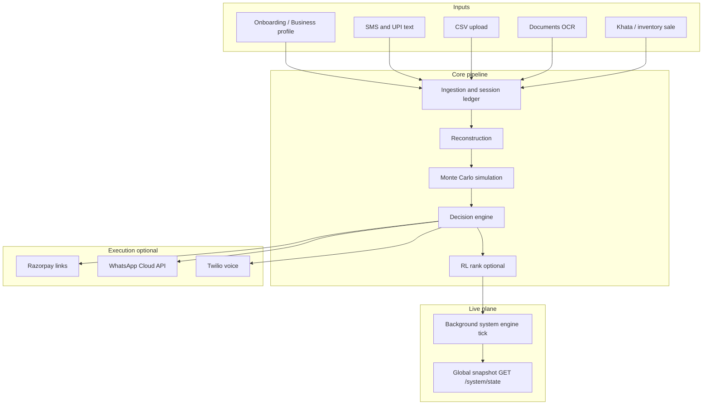
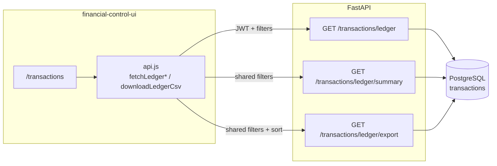
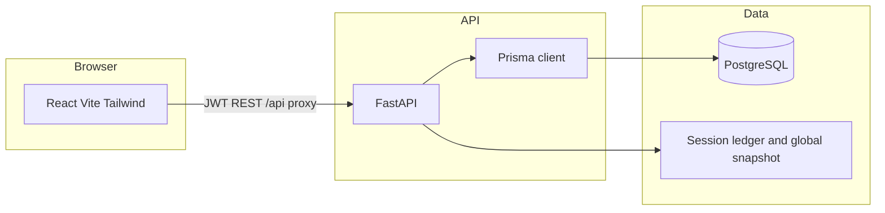

# Self-Learning Financial Control System for SMBs

**Voice-first AI that predicts cash risk, recommends what to do today, and can execute collections, built for real Indian SMB behavior (Hindi / Hinglish, messy data, action over analytics).**

*Repository: [smb-ai-financial-autopilot](https://github.com/shrijatewari/smb-ai-financial-autopilot)*

---

## Problem

Small businesses rarely fail from lack of effort – they fail because **the financial future is invisible**.

- Cash flow is **unpredictable** (UPI + cash + khata, not one clean ledger)  
- **Payments are delayed**; owners don’t know who hurts them most today  
- Records are **incomplete** – digital and cash don’t match  
- Most “SMB tools” are **dashboards**, not **decision systems**  

Owners don’t want another chart. They need:

**“What should I do today?”**

---

## Solution

A **Self-Learning Financial Control System** that:

| Capability | What it means |
|------------|----------------|
| **Reconstructs** messy inputs | SMS/UPI text, CSV, OCR, khata → working signals |
| **Simulates** uncertainty | Monte Carlo paths, cash-at-risk over a horizon |
| **Decides** | Collect, delay expense, collections priority – not only KPIs |
| **Executes** (optional live hooks) | Razorpay links, Meta WhatsApp reminders, Twilio voice |
| **Speaks your language** | Hindi, Hinglish, regional via translation + voice assistant |
| **Today-first UX** | “Aaj kya karna hai” – one risk line, one action, three buttons |

This is **not** a passive dashboard. It is an **operating layer** that sits on top of messy reality.

---

## Key features

### Financial intelligence
- Cash & horizon risk from reconstructed ledger + simulation  
- Monte Carlo cash paths (configurable paths / horizon)  
- Missing / inferred cash reconstruction from observed flows  

### Decision engine
- Prioritized actions (e.g. collect payment, reduce expense, delay payable)  
- **Before / after** outcome hints (collect vs do nothing)  
- Tabular RL hooks – action ordering can improve over feedback  

### Execution layer
- **Razorpay payment links** (`POST /execute/payment-link`) when `RAZORPAY_KEY_ID` / `RAZORPAY_KEY_SECRET` are set; optional `description` for the link; otherwise structured mock `rzp.io` URLs  
- **Collections in one step** – `POST /execute/collect` creates a Razorpay link for the outstanding amount and sends the WhatsApp message with the link embedded (same body as `POST /execute/whatsapp`)  
- **`POST /execute/whatsapp`** – reminder text includes shop name and ends with the Razorpay payment link; response returns `payment_link`, `payment_link_mock`, `razorpay_id` for the UI  
- **Meta WhatsApp** outbound when `WHATSAPP_*` is configured; otherwise simulated send  
- **Twilio** Hindi voice calls (`POST /execute/twilio-call`) when `TWILIO_*` is set  
- Simulated call scripts when integrations are off  

### Voice assistant (India-first)
- Multilingual pipeline: detect → translate → core engine → translate back  
- gTTS / browser speech; optional OpenAI Whisper for uploaded audio  
- Assistant UI: `financial-control-ui` → `/assistant`  

### Data integration
- SMS / UPI text ingest → ledger rows  
- Document OCR (Google Vision optional; local Tesseract fallback)  
- Paytm-style mock feed  
- Inventory + **khata** sale → stock + ledger movement when you apply a sale  
- **Bills (POS / OCR)** – `POST /bills/ingest-json`, `POST /bills/ingest-ocr`, `GET /bills/history`, detail + file routes; updates inventory (auto-creates SKUs when names don’t match), ledger credit (`sale` / `bill_ingest`), optional khaata (Customer) link + WhatsApp proof hooks  
- **Inventory stock %** – `stock_ceiling` high-water field so “Stock level” reflects real depletion (not stuck at 100% when quantity ≫ reorder band)  
- **Persisted ledger** (`LedgerTransaction` in PostgreSQL) – filtered list, aggregates, and CSV export via `GET /transactions/ledger*`, with the **Transactions** page (`/transactions`) in `financial-control-ui` staying in sync (bookmarkable query string). See **Persisted ledger API** below and `backend/README.md`.  

### Adaptive UI
- Onboarding-driven **business profile** → module mix and emphasis  
- **Today** home (`/`) – action-first; full analytics under `/dashboard`  
- **Bills** (`/bills`) – POS JSON + PDF/image OCR ingest, guided overlay + voice summary (header speaker); collection toasts show copyable Razorpay links  
- **Predictions / Andaza** – guided steps + voice aligned with Today  
- **Voice guidance** – header mute cancels browser TTS and pending Hinglish follow-up; works across Today, Bills, Predictions  

---

## Recently implemented (product + API)

| Area | What shipped |
|------|----------------|
| **Collections** | `POST /execute/collect` = Razorpay link + WhatsApp in one call; messages use shop name from profile / override; Razorpay `description` like `Payment to {shop} - outstanding dues` |
| **WhatsApp reminders** | `POST /execute/whatsapp` embeds the same payment link; optional `shop_name`, `customer_email`; bill-proof path unchanged for `customer_id` + linked bill |
| **Bills** | Prisma `Bill` model; ingest pipelines; `Customer.bill_id`; inventory `last_bill_deduct_at`; history table in UI when API is deployed |
| **Inventory** | `stock_ceiling` on `InventoryItem`; bar uses `quantity / ceiling` when set |
| **Frontend deploy** | Netlify: `financial-control-ui/netlify.toml` + root monorepo `netlify.toml` with `VITE_API_URL`; CLI `netlify deploy --build --prod` from repo root |
| **Backend deploy** | Fly.io: `backend/fly.toml`, `Dockerfile`, release `prisma db push`; example API host `https://smb-financial-api.fly.dev` (rename app in `fly.toml` for your org) |

---

## How it works



The **system engine** runs on a timer (default ~5s), refreshes simulation output, and updates the snapshot the UI polls.

---

## Persisted ledger API (PostgreSQL)

Durable rows live in the `transactions` table (Prisma model `LedgerTransaction`). The UI calls the same query parameters for **list**, **summary**, and **CSV export** (summary omits `sort` and pagination; export uses a server-side row cap).



| Query param | List | Summary | Export | Purpose |
|-------------|:----:|:-------:|:------:|---------|
| `date_from`, `date_to` | ✓ | ✓ | ✓ | UTC day bounds (`YYYY-MM-DD`) |
| `q` | ✓ | ✓ | ✓ | Case-insensitive substring on description (max 200 chars) |
| `source` | ✓ | ✓ | ✓ | Exact match, case-insensitive (max 32 chars) |
| `category` | ✓ | ✓ | ✓ | Exact match, case-insensitive (max 32 chars) |
| `txn_type` | ✓ | ✓ | ✓ | `credit` or `debit` |
| `sort` | ✓ | – | ✓ | `date_desc` (default), `date_asc`, `amount_desc`, `amount_asc` |
| `offset`, `limit` | ✓ | – | – | Pagination on list only (export is full filtered set up to server `limit`) |

Filters can be combined; the Transactions page mirrors them in the URL for sharing (`?date_from=&date_to=&q=&source=&category=&txn_type=&sort=`).

---

## Architecture



| Layer | Stack |
|-------|--------|
| **API** | FastAPI, Pydantic, JWT, Prisma (Python) |
| **UI** | React 19, Vite, Tailwind (`financial-control-ui/`) |
| **ML / rules** | scikit-learn, custom credit / fraud helpers |
| **Simulation** | Monte Carlo over ledger-derived dynamics |
| **Voice / NL** | langdetect, deep-translator, gTTS, optional OpenAI Whisper + chat |
| **Integrations** | Razorpay SDK, Meta WhatsApp Graph, Twilio Voice |
| **OCR** | PyMuPDF, Pillow, Google Vision or Tesseract |
| **DB** | PostgreSQL – users, profiles, inventory, documents, RL state, etc. |

---

## Data model (high level)

Persistent entities (see `backend/prisma/schema.prisma`):

- **Users** – auth identity  
- **OnboardingProfile / BusinessProfile** – business context for the twin  
- **LedgerTransaction** (`transactions` table) – persisted movements (ingestion, webhooks, AA); list/summary/export via `GET /transactions/ledger*`  
- **Predictions / actions / executions** – financial and decision trace  
- **Customers** – receivable-oriented records; optional **`bill_id`** link to proof for WhatsApp udhar flows  
- **Documents** – OCR pipeline outputs  
- **InventoryItem** (incl. **`stock_ceiling`**, **`last_bill_deduct_at`**) / **KhataUpload** – stock and paper khata  
- **Bill** – POS / OCR ingested bills (lines, totals, status)  
- **RlState** – learning metadata  

The **live cash / risk / collection queue** in the demo is also driven by an **in-memory snapshot** updated by the engine (fast path for hackathon demos); Prisma holds durable business state.

---

## What makes this different

| Typical SMB SaaS | This system |
|------------------|-------------|
| Static dashboards | **Decision + execution** loop |
| English-only analytics | **Hindi / Hinglish / regional** assistant path |
| “Log in and see charts” | **“What do I do today?”** + optional one-tap actions |
| Assumes clean books | Built for **partial, messy, real** inputs |
| Passive | **Self-learning hooks (RL)** + real outbound adapters |

---

## Demo (2 minutes)

1. **Risk** – Snapshot shows stress horizon (e.g. cash shortage probability over N days).  
2. **Action** – “Collect from [top of collection queue]” with ₹ amount.  
3. **Execute** – **Send WhatsApp** runs **`POST /execute/collect`** (Razorpay link embedded in the message); **Copy payment link only** uses **`POST /execute/payment-link`**; **call** via Twilio when configured.  
4. **Bills** – **`/bills`** – paste POS JSON or upload a bill image/PDF (needs backend with `/bills` routes + DB migrated).  
5. **Voice** – Open **`/assistant`**, choose **हिंदी**, ask: *“Mujhe kya karna chahiye?”*  
6. **Today screen** – **`/`** shows one-line risk + one action + WhatsApp / copy link / Call / System buttons.

---

## Setup

### Prerequisites

- Python **3.11+** · Node **18+** · **PostgreSQL** (Docker recommended)  

### Backend

```bash
git clone https://github.com/shrijatewari/smb-ai-financial-autopilot.git
cd smb-ai-financial-autopilot/backend
docker compose up -d
python3 -m venv .venv && source .venv/bin/activate
pip install -r requirements.txt
cp .env.example .env
export PATH="$(pwd)/.venv/bin:$PATH"
./scripts/sync-prisma-db.sh
uvicorn main:app --reload --host 0.0.0.0 --port 8000
```

- API docs: http://127.0.0.1:8000/docs  
- Optional: `python scripts/seed_mock_data.py` for demo DB rows  

### Frontend

```bash
cd ../financial-control-ui
npm install
npm run dev
```

Open **http://localhost:5173** – Vite proxies `/api` → backend (see `vite.config.js`).

**Auth:** sign up → complete **onboarding** → app unlocks.

### Deploy UI

| Target | Notes |
|--------|--------|
| **Netlify** | Root **`netlify.toml`** (`base = financial-control-ui`) or deploy from **`financial-control-ui/`**; set **`VITE_API_URL=https://&lt;your-api-host&gt;`** (no trailing slash). Example in **`financial-control-ui/.env.example`**. |
| **Vercel** | Root **`vercel.json`** builds **`financial-control-ui/`**. Set **`VITE_API_URL`** to your HTTPS API origin. |

Backend must be a **long-running** host (Fly, Railway, Render, VPS) + PostgreSQL – not Vercel/Netlify serverless functions for the FastAPI app.

[](https://vercel.com/new/clone?repository-url=https%3A%2F%2Fgithub.com%2Fshrijatewari%2Fsmb-ai-financial-autopilot&root-directory=.)

### Deploy API (Fly.io example)

From **`backend/`**:

```bash
fly auth login
fly deploy --wait-timeout 30m --release-command-timeout 30m
```

`fly.toml` runs **`prisma db push`** on release. Ensure **`DATABASE_URL`** and secrets are set on the Fly app.

---

## Environment (summary)

| File | Purpose |
|------|---------|
| `backend/.env` | `DATABASE_URL`, JWT, **`RAZORPAY_KEY_ID` / `RAZORPAY_KEY_SECRET`** (payment links; omit for demo mocks), **`WHATSAPP_*`** (Meta), Twilio, OpenAI (optional), engine tuning |
| `financial-control-ui/.env` | Production: **`VITE_API_URL`** = public API origin (must expose `/bills`, `/execute/*`, etc. that you use) |

Copy from each **`.env.example`**. Never commit secrets.

---

## Future Work

* Expand **Paytm and banking integrations** to support real-time transaction sync and reconciliation
* Fully integrate **Razorpay webhooks** to automatically post settlements into the ledger (extend current partial support to cover all event types)
* Enhance **Reinforcement Learning (RL)** models with improved policies, training pipelines, and evaluation metrics
* Develop **credit and lending scoring APIs** for risk assessment and financial insights
* Add comprehensive **regional language support** across the entire platform for better accessibility
* Implement **Server-Sent Events (SSE) / WebSockets** for real-time push updates instead of polling (existing SSE endpoint: `/system/stream`)


---

## Vision

**Build an AI financial operating system so millions of SMBs can make better cash decisions every day – without needing a finance degree or English-first dashboards.**

---

## Reference

| Topic | Where |
|-------|--------|
| Backend routes, ledger, Prisma | `backend/README.md` |
| Frontend routes, `api.js`, Transactions | `financial-control-ui/README.md` |
| **Bills API** | `GET/POST /bills/*` – see OpenAPI `/docs` |
| **Execute: payment link, WhatsApp, collect** | `POST /execute/payment-link`, `/execute/whatsapp`, `/execute/collect` |
| UI deploy | Root **`vercel.json`** · **`netlify.toml`** (monorepo) · **`financial-control-ui/netlify.toml`** |
| API deploy | **`backend/fly.toml`**, **`backend/Dockerfile`** |
| Prisma schema | `backend/prisma/schema.prisma`, `./scripts/sync-prisma-db.sh` |
| Troubleshooting | Prisma on `PATH`, DB up, onboarding completed; frontend 404 on `/bills` → deploy latest UI bundle; API 404 on `/bills/*` → deploy latest backend + `prisma db push` |

**License:** Add a `LICENSE` when you open-source; until then all rights reserved unless stated otherwise.

