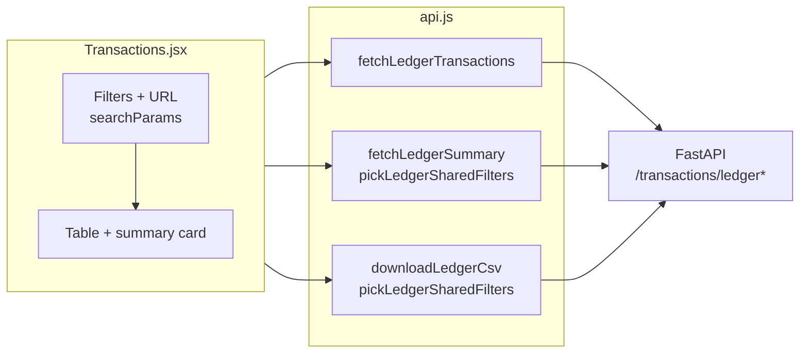

# Financial Control UI

React + Vite + Tailwind single-page app for the **SMB AI Financial Autopilot** product: dashboard, auth, onboarding (required before main routes), transactions, cash flow, inventory / khata, risk, GST, documents, assistant, and profile.

---

## Requirements

- **Node.js** 18+ (20+ recommended)
- **npm** (ships with Node)
- Running **backend** API (default `http://localhost:8000`) – see repository root `README.md` and `../backend/README.md`

---

## Install & run (development)

```bash
cd financial-control-ui
npm install
npm run dev
```

Vite defaults to **http://localhost:5173** (see `vite.config.js`).

### API base URL

| Mode | Behavior |
|------|----------|
| **Dev (recommended)** | Leave `VITE_API_URL` **unset**. The dev server **proxies** `/api` → `http://localhost:8000` and strips the `/api` prefix so the frontend can call `axios` with `baseURL: '/api'` (see `src/services/api.js`). |
| **Production / preview** | Set `VITE_API_URL` to your API origin (no trailing slash), e.g. `https://api.example.com`. |

Copy `.env.example` to `.env` or `.env.local` only when you need to override:

```bash
cp .env.example .env.local
# Uncomment and set VITE_API_URL=... if not using the dev proxy
```

---

## Deploying

| Platform | Config |
|----------|--------|
| **Vercel** | Monorepo root **`vercel.json`** builds this folder. Set **`VITE_API_URL`** to your FastAPI origin. |
| **Netlify** | Root **`netlify.toml`** (`base = financial-control-ui`) or **`netlify.toml`** inside this folder; **`[build.environment] VITE_API_URL`** for production builds. |

See repository **`../README.md`** → **Deploy UI** and **Deploy API**.

---

## Collections, bills, and execute helpers

- **Today** (`/`) – **Send WhatsApp** uses **`postExecuteCollect()`** → `POST /execute/collect` (Razorpay link inside the message); toast shows a copyable **`payment_link`**. **Copy payment link only** uses **`postPaymentLink()`** → `POST /execute/payment-link`.  
- **People** / **⌘K palette** – same collect endpoint for queue rows where applicable.  
- **Bills** (`/bills`) – **`getBillHistory`**, **`ingestBillJson`**, **`ingestBillOcr`** in **`api.js`**; requires backend **`/bills`** routes and DB migrated.  

Voice mute in the header cancels browser TTS (see **`src/lib/voice.js`**).

---

## Scripts

| Command | Description |
|---------|-------------|
| `npm run dev` | Hot-reload dev server with `/api` proxy |
| `npm run build` | Production build → `dist/` |
| `npm run preview` | Serve `dist/` locally (set `VITE_API_URL` if API is not proxied) |

---

## Authentication

- Token stored in **`localStorage`** under key `financial_control_token` (see `src/services/api.js`).
- **`AuthProvider`** (`src/context/AuthContext.jsx`) loads `GET /auth/me` on startup; user must have **`onboarding_completed: true`** before protected routes (except `/onboarding`) – enforced in `src/layout/ProtectedLayout.jsx`.
- Logout clears token and user state.

---

## Project structure (selected)

```text
src/
├── components/       # Dashboard, shared UI (e.g. ui/card)
├── context/          # AuthContext
├── layout/           # AppShell, Sidebar, ProtectedLayout
├── pages/            # Login, Signup, Onboarding, Transactions, Inventory, ...
├── services/api.js   # Axios instance, all API helpers
└── App.jsx           # Routes
```

---

## Transactions & persisted ledger

The **Transactions** page (`/transactions`) loads:

- **`GET /transactions/paytm`** – mock Paytm feed when connected (optional).
- **`GET /transactions/ledger`** – persisted `LedgerTransaction` rows with filters, sort, and pagination.
- **`GET /transactions/ledger/summary`** – aggregates for the same **shared** filters (no `sort` / pagination).
- **`GET /transactions/ledger/export`** – CSV download with the same filters plus optional `sort`.

**`fetchNotifications`** (Profile → briefing log): if **`GET /notifications`** errors or returns an invalid payload, **`getMockNotificationsResponse()`** in **`src/lib/platformMocks.js`** supplies demo rows (`_mockFallback: true`).

**`src/services/api.js`** keeps summary and export aligned with the backend:

- **`LEDGER_SHARED_FILTER_KEYS`** – `date_from`, `date_to`, `q`, `source`, `txn_type`, `category`, passed to **`pickLedgerSharedFilters()`** for **`fetchLedgerSummary`** and **`downloadLedgerCsv`**.
- **`fetchLedgerTransactions`** forwards all params; default **`sort=date_desc`** is omitted so URLs stay minimal.

Filters sync to the **URL query string** (bookmarkable):  
`?date_from=&date_to=&q=&source=&category=&txn_type=&sort=`  
Apply / Clear updates the URL; `offset` is client-only (pagination). Paytm/mock preview rows are filtered in the browser for the same dimensions where applicable.



See **`../README.md`** (persisted ledger table) and **`../backend/README.md`** (full API semantics).

### Platform lab (`/platform`)

The **Platform capabilities** page lists live vs mock product features (Account Aggregator, GST, Razorpay webhook, SSE, WhatsApp intents, late-payment demo scores, anomaly / what-if mocks, PWA roadmap, etc.) with interactive demos backed by `src/lib/platformMocks.js`. Use **Advanced** sidebar mode to open **Platform lab**, or **Profile → Platform lab**.

---

## Styling

- **Tailwind CSS v4** with `@tailwindcss/vite`
- Brand accent: violet / `#6C3BFF` (see components)

---

## Troubleshooting

| Problem | Fix |
|---------|-----|
| `Network Error` / cannot reach API | Start backend on port **8000**; in dev, do **not** set `VITE_API_URL` unless you know the full URL |
| CORS errors in browser | Backend allows `*` for dev; if you bypass proxy, configure CORS or use same-origin deployment |
| Stuck on onboarding after saving | Backend must persist onboarding and return `onboarding_completed: true` on `GET /auth/me`; call refresh / re-login |
| Build fails | Run `npm install` again; ensure Node 18+ |

---

## Related docs

- Repository overview (persisted ledger): **`../README.md`**
- Backend API (full ledger parameter table): **`../backend/README.md`**
- OpenAPI: `http://localhost:8000/docs` when the backend is running
